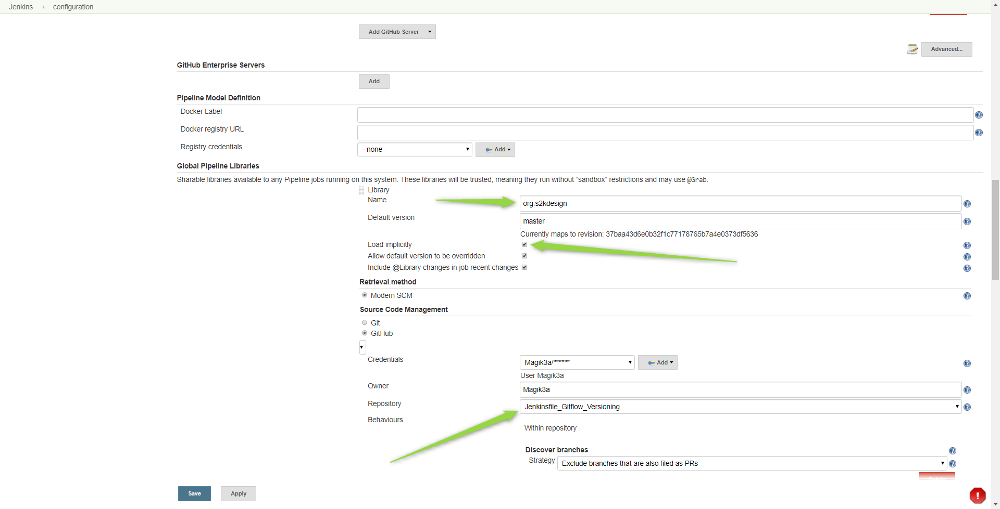

# Jenkins Shared Pipeline Libraries
Fork this repo and change the files in resources folder to configure all of your projects to have one version for each branch (helpful when multiple teams are releasing every 2 weeks and the version of all team projects should be controlled in one place )
```
resources/
    master_version  - 1.19.12
```
After that go to Jenkins -> Configure System and add the settings from the picture bellow


### Methods
GitFlow Versioning in Jenkinsfile:

```
- get_version(String branchName)
   - Master Branch  - 1.19.12.BUILD_NUMBER = 1.19.12.0
   - Hotfix Branch  - *.**.+1.BUILD_NUMBER = 1.19.13.1
   - Release Branch - *.+1.+1.BUILD_NUMBER = 1.20.13.1
   - Develop Branch - *.+1.+1.BUILD_NUMBER = 1.20.13.1
   - Feature Branch -+1.+1.+1.BUILD_NUMBER = 2.20.13.1
```
MsBuild publishing for projects:
- TODO

.NET Core publishing for projects:
- TODO
### How to use it in your Jenkinsfile 

```Groovy
// add the following line and replace necessary values if you are not loading the library implicitly
// @Library(['github.com/Magik3a/Jenkinsfile_Gitflow_Versioning/org.s2kdesign']) _

pipeline {
 agent any
    environment {
        // Version is defined in external pipeline library https://github.com/Magik3a/Jenkinsfile_Gitflow_Versioning
        PROJECT_VERSION = get_version(GIT_BRANCH)
        PROJECT_PATH = "HiddenHook/HiddenHook.Web/HiddenHook.Web.csproj"
        PROJECT_NAME = "HiddenHook"  
     }
    stages {
            
        stage('Publish Project') {
            steps {
                publishProject()
            }
        }

        stage('Get Artifacts') {
            steps {
                zipArtifacts()
                getArtifacts()
            }        
        }
				
    }

    options {
        // make sure we only keep 50 builds at a time, so we don't fill up our storage!
        buildDiscarder(logRotator(numToKeepStr:'50'))
    }
}
def publishProject(){
    bat 'dotnet publish '+ PROJECT_PATH +' -c Debug -o ../../Publish/Debug /P:AssemblyVersion='+ PROJECT_VERSION +' /P:Version='+ PROJECT_VERSION 
    bat 'dotnet publish '+ PROJECT_PATH +' -c Release -o ../../Publish/Release /P:AssemblyVersion='+ PROJECT_VERSION +' /P:Version='+ PROJECT_VERSION 
     
}
def zipArtifacts(){
    zip zipFile: PROJECT_NAME +'Debug.zip', archive: false, dir: 'Publish/Debug'
    zip zipFile: PROJECT_NAME +'Release.zip', archive: false, dir: 'Publish/Release'
}
def getArtifacts(){    
    archiveArtifacts artifacts: PROJECT_NAME +'Debug.zip', fingerprint: true
    archiveArtifacts artifacts: PROJECT_NAME +'Release.zip', fingerprint: true
}
```